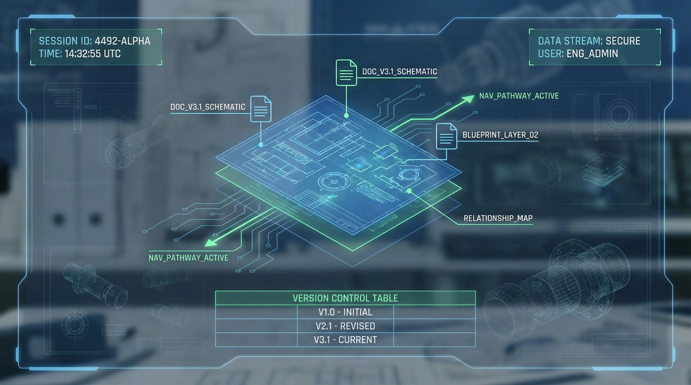
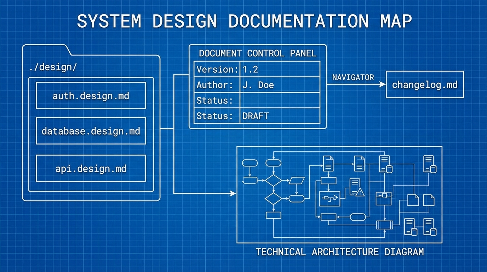
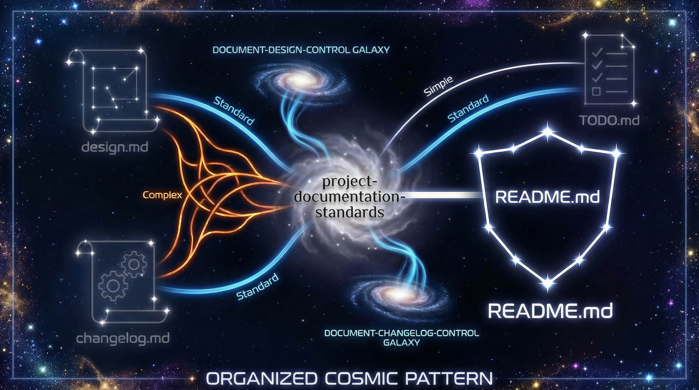

<div align="center">

<!-- Hero Banner -->


<!-- Hero Title -->
<h1>
  
  Claude Code Rules & Framework
  
</h1>

<p>
  <i>Your Claude Code AI assistant, elevated to professional standards</i>
</p>

<!-- Quick Stats Cards -->
<table>
<tr>
<td align="center" width="200">
  
  <br><br>
  <b>100%</b><br><sub>Factual Accuracy</sub>
</td>
<td align="center" width="200">
  
  <br><br>
  <b>82%</b><br><sub>Token Savings</sub>
</td>
<td align="center" width="200">
  
  <br><br>
  <b>50%</b><br><sub>Faster Response</sub>
</td>
<td align="center" width="200">
  
  <br><br>
  <b>100%</b><br><sub>Constitutional</sub>
</td>
</tr>
</table>

<!-- CTA Buttons -->
<p>
  <a href="#-quick-start">
    
  </a>
  <a href="#-installation">
    
  </a>
  <a href="#-visual-guide">
    
  </a>
</p>

---

</div>

## 📑 Table of Contents

- [⚡ Quick Start](#-quick-start)
- [📦 Installation](#-installation)
- [✨ Features](#-features)
- [📁 Rule Files](#-rule-files)
- [🖼️ Visual Guide](#️-visual-guide)
- [🎓 Framework Highlights](#-framework-highlights)
- [📊 Before & After](#-before--after)
- [🤝 Contributing](#-contributing)

---

## ⚡ Quick Start

<div align="center">

```bash
# 🚀 One-line installation - Clone and install
git clone https://github.com/DarKWinGTM/claude-code-rules.git && \
cp claude-code-rules/*.md ~/.claude/rules/
```

✨ **That's it!** Your Claude Code is now enhanced with professional rules.

</div>

---

## 📦 Installation

### 🎯 Method 1: Full Installation (Recommended)

Complete setup with all rules:

```bash
# Step 1: Clone the repository
git clone https://github.com/DarKWinGTM/claude-code-rules.git
cd claude-code-rules

# Step 2: Create rules directory (if not exists)
mkdir -p ~/.claude/rules

# Step 3: Copy all rule files
cp *.md ~/.claude/rules/

# Step 4: Verify installation
ls ~/.claude/rules/
```

### 🎯 Method 2: Pick Your Rules

Install only what you need:

```bash
# Example: Install just the anti-sycophancy rule
curl -o ~/.claude/rules/anti-sycophancy.md \
  https://raw.githubusercontent.com/DarKWinGTM/claude-code-rules/master/anti-sycophancy.md
```

### 🎯 Method 3: Project-Specific

Add rules to a single project:

```bash
# In your project directory
mkdir -p .claude/rules
cp /path/to/claude-code-rules/*.md .claude/rules/
```

### 📍 Installation Paths

| Location | Scope | Path | Use Case |
|----------|-------|------|----------|
| **Global** | All projects | `~/.claude/rules/*.md` | Default recommendation |
| **Project** | Current project only | `./.claude/rules/*.md` | Project-specific needs |

### 📂 Design Documentation Structure

| Location | Purpose | File Type |
|----------|---------|-----------|
| `./design/*.design.md` | Design specifications | Design docs |
| `*.md` (root) | Working rules | Rules files |
| `./changelog/*.md` | Version history | Changelogs |

> **💡 Single Source of Truth Principle:**
> - Design files (`.design.md`) contain Version History sections
> - Rules files rely on Git for history tracking
> - One authoritative source per document type

### ✅ Verify Installation

```bash
# Check if rules are loaded
claude --version
cat ~/.claude/rules/anti-sycophancy.md | head -20
```

---

## ✨ Features

<div align="center">

### 🎯 Core Capabilities

<table>
<tr>
<td width="50%">

#### 🔍 Zero Hallucination
- 100% verified information only
- Evidence-based responses
- No guessing or assumptions
- Source citations always included

</td>
<td width="50%">

#### 🛡️ Anti-Sycophancy
- Truth over agreement
- Direct corrections when needed
- No false praise
- Honest feedback, always

</td>
</tr>
<tr>
<td width="50%">

#### 🔒 Security First
- Real systems over simulations
- No mock implementations by default
- Verified configurations only
- Production-ready patterns

</td>
<td width="50%">

#### ⚡ Performance Optimized
- 30-50% faster responses
- 40-82% token reduction
- Adaptive complexity (TRAAC)
- Cost-efficient operations

</td>
</tr>
</table>

</div>

---

## 📁 Rule Files

<div align="center">

### 🔴 Core Policies (3 rules)

> **Fundamental principles that govern all AI behavior**

| Rule | Purpose | Key Benefit |
|:-----|:--------|:------------|
| [`anti-mockup.md`](anti-mockup.md) | Real systems over simulations | No fake implementations |
| [`anti-sycophancy.md`](anti-sycophancy.md) | Truth over agreement | Honest feedback always |
| [`zero-hallucination.md`](zero-hallucination.md) | Verified information only | 100% accuracy |

---

### 🟡 Quality & Safety (9 rules)

> **Ensure consistent, safe, and well-documented outputs**

| Rule | Purpose | Key Benefit |
|:-----|:--------|:------------|
| [`authority-and-scope.md`](authority-and-scope.md) | Decision hierarchy | User authority respected |
| [`document-consistency.md`](document-consistency.md) | Cross-reference validation | No contradictions |
| [`document-changelog-control.md`](document-changelog-control.md) | Version tracking system | Single Source of Truth |
| [`document-design-control.md`](document-design-control.md) | Design document standards | Standardized structure |
| [`emergency-protocol.md`](emergency-protocol.md) | Crisis response | Fast, safe reactions |
| [`functional-intent-verification.md`](functional-intent-verification.md) | Intent validation | Commands verified before run |
| [`strict-file-hygiene.md`](strict-file-hygiene.md) | File hygiene | No unrequested docs |
| [`project-documentation-standards.md`](project-documentation-standards.md) | Project documentation standards | Standardized docs for all projects |

---

### 🟢 Best Practices (4 rules)

> **Optimize your daily workflow efficiency**

| Rule | Purpose | Key Benefit |
|:-----|:--------|:------------|
| [`flow-diagram-no-frame.md`](flow-diagram-no-frame.md) | Clean ASCII diagrams | Better readability |
| [`no-variable-guessing.md`](no-variable-guessing.md) | Read before reference | No wrong assumptions |
| [`safe-file-reading.md`](safe-file-reading.md) | Plan-before-read | Efficient file handling |
| [`safe-terminal-output.md`](safe-terminal-output.md) | Output management | No terminal flooding |

**📊 Total: 16 Rules = Complete Professional Framework**

</div>

---

## 🖼️ Visual Guide

<div align="center">

### 🔴 Core Policies Visual

<table>
<tr>
<td align="center" width="33%">
<br>
<b>Anti-Sycophancy</b><br>
<sub>Truth over pleasing</sub>
</td>
<td align="center" width="33%">
<br>
<b>Anti-Mockup</b><br>
<sub>Real systems only</sub>
</td>
<td align="center" width="33%">
<br>
<b>Zero Hallucination</b><br>
<sub>Verified info only</sub>
</td>
</tr>
</table>

---

### 🟡 Quality & Safety Visual

<table>
<tr>
<td align="center" width="25%">
<br>
<b>Authority & Scope</b><br>
<sub>User authority supreme</sub>
</td>
<td align="center" width="25%">
<br>
<b>Emergency Protocol</b><br>
<sub>Rapid response</sub>
</td>
<td align="center" width="25%">
<br>
<b>Document Consistency</b><br>
<sub>Cross-reference check</sub>
</td>
<td align="center" width="25%">
<br>
<b>Functional Intent</b><br>
<sub>Intent validation</sub>
</td>
</tr>
<tr>
<td align="center" width="25%">
<br>
<b>Document Changelog Control</b><br>
<sub>Version tracking system</sub>
</td>
<td align="center" width="25%">
<br>
<b>Document Design Control</b><br>
<sub>Design standards</sub>
</td>
<td align="center" width="25%">
<br>
<b>Strict File Hygiene</b><br>
<sub>No unrequested docs</sub>
</td>
<td align="center" width="25%">
<br>
<b>Project Documentation Standards</b><br>
<sub>Standardized docs</sub>
</td>
</tr>
</table>

---

### 🟢 Best Practices Visual

<table>
<tr>
<td align="center" width="25%">
<br>
<b>Flow Diagram</b><br>
<sub>No frames, clean arrows</sub>
</td>
<td align="center" width="25%">
<br>
<b>No Guessing</b><br>
<sub>Read before reference</sub>
</td>
<td align="center" width="25%">
<br>
<b>Safe File Reading</b><br>
<sub>Plan before read</sub>
</td>
<td align="center" width="25%">
<br>
<b>Safe Terminal</b><br>
<sub>Output management</sub>
</td>
</tr>
</table>

</div>

---

## 🎓 Framework Highlights

### 🧠 TRAAC (Task Runtime Adaptive AI Compression)

<div align="center">

**Dynamic complexity adjustment based on task requirements**

```
Simple Tasks (Level 0-2)     → Minimal Processing
     ↓
Standard Tasks (Level 3-5)   → Balanced Approach
     ↓
Complex Tasks (Level 6-7)    → Deep Analysis
```

| Metric | Improvement | Impact |
|--------|-------------|--------|
| Response Speed | +30-50% | Faster answers |
| Token Efficiency | +40-82% | Lower costs |
| Cost Reduction | -25-35% | Budget-friendly |

</div>

---

### 👥 TUMIX Multi-Agent System

<div align="center">

**Three expert perspectives analyzing every complex problem**

```text
Developer ──┐
Security  ──┼──→ Unified Recommendation
Architect ──┘
```

**How It Works:**
1. **Developer Agent** → Technical feasibility analysis
2. **Security Agent** → Security & privacy evaluation
3. **Architect Agent** → System design considerations
4. **Synthesis** → All perspectives merge into unified recommendation

**Result:** Comprehensive analysis from multiple angles

</div>

---

### 📚 RoT (Retrieval of Thoughts)

<div align="center">

**Cache and reuse verified reasoning patterns**

| Action | Benefit |
|--------|---------|
| **Cache** verified patterns | Store successful approaches |
| **Reuse** for similar tasks | 40% speed improvement |
| **Validate** before use | Ensure accuracy maintained |

**Performance:** 82% cache hit rate for recurring patterns

</div>

---

## 📊 Before & After

<div align="center">

### ❌ Without Rules

```text
User: "Set up database connection"
       ↓
AI: "Here's the connection string:
     DATABASE_URL=postgres://localhost:5432/mydb"

Result: ❌ Guessed values
        ❌ No verification
        ❌ Potentially wrong
        ❌ User frustrated
```

---

### ✅ With Rules

```text
User: "Set up database connection"
       ↓
AI: "Let me check your .env file first..."
     [Reading configuration...]
     "Found your existing config:
      DATABASE_URL=postgres://prod-server:5432/app_db

      Should I use this, or do you want to change it?"

Result: ✅ Verified from actual files
        ✅ No guessing
        ✅ User confirmation
        ✅ Professional interaction
```

**The difference?** Professional AI behavior that respects your existing configuration.

</div>

---

## 📊 Performance Metrics

<div align="center">

| Metric | Target | Status | Impact |
|--------|:------:|:------:|--------|
| Factual Accuracy | 100% | ✅ | Zero hallucinations |
| Constitutional Compliance | 100% | ✅ | User sovereignty maintained |
| Token Efficiency | +40-82% | ✅ | Cost reduction |
| Response Speed | +30-50% | ✅ | Faster delivery |
| User Sovereignty | Absolute | ✅ | User always in control |

</div>

---

## 🔒 Safety Guarantees

<div align="center">

### ✅ Our Commitment to You

| Guarantee | Description |
|-----------|-------------|
| **No Mock/Stub** | Real implementations unless explicitly requested |
| **No Guessing** | Always verify from actual sources |
| **No Hallucinations** | 100% fact-based responses |
| **No Sycophancy** | Truth over agreement, always |
| **Constitutional** | Principles override everything |

**Your safety and accuracy are non-negotiable.**

</div>

---

## 🤝 Contributing

<div align="center">

These rules evolve based on real-world usage:

- 🔄 **Real-world usage patterns** → What actually works
- 💬 **User feedback** → Your experience matters
- 🔐 **Safety considerations** → Always improving
- ⚡ **Performance optimization** → Getting faster

### 📝 Contribution Guidelines

**Pull requests welcome!** Please ensure:
1. New rules follow existing format
2. Include clear documentation
3. Add visual assets if applicable
4. Update changelog

**We value:** Quality over quantity, clarity over complexity

</div>

---

## 📜 License

<div align="center">

**MIT License** - Feel free to adapt for your own use case.

> Attribution appreciated but not required.

</div>

---

## 🙏 Acknowledgments

<div align="center">

Personal rule set and configuration framework for Claude Code CLI.

**Inspired by:**
- Constitutional AI principles (Anthropic)
- Best practices for AI assistant development
- Real-world production experience
- Community feedback and contributions

**Built with ❤️ for the Claude Code community**

</div>

---

<div align="center">

---

<p>
  <b>Version</b>: 2.0.0 |
  <b>Last Updated</b>: 2026-01-21 |
  <b>Framework</b>: Sophisticated AI Framework with Constitutional Governance
</p>

<p>
  <a href="#️-claude-code-rules--framework">⬆️ Back to Top</a>
</p>

---

<p>
  <sub>Made with 💙 by developers who care about AI quality</sub>
</p>

</div>
