<a id="top"></a>
<div align="center">

<!-- Hero Banner -->
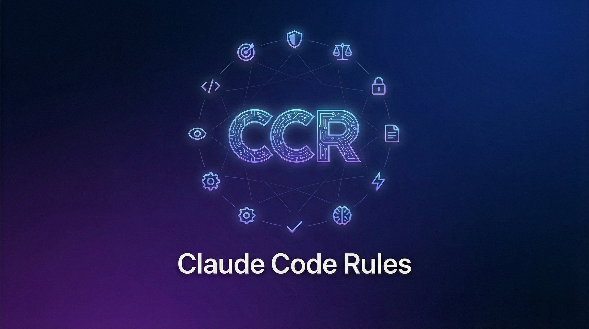

<!-- Hero Title -->
<h1>
  🏛️
  Claude Code Rules & Framework
  🏛️
</h1>

<p>
  <i>Your Claude Code AI assistant, elevated to professional standards</i>
</p>

<!-- Quick Stats Cards -->
<table>
<tr>
<td align="center" width="200">
  
  <br><br>
  <b>100%</b><br><sub>Factual Accuracy</sub>
</td>
<td align="center" width="200">
  
  <br><br>
  <b>82%</b><br><sub>Token Savings</sub>
</td>
<td align="center" width="200">
  
  <br><br>
  <b>50%</b><br><sub>Faster Response</sub>
</td>
<td align="center" width="200">
  
  <br><br>
  <b>100%</b><br><sub>Constitutional</sub>
</td>
</tr>
</table>

<!-- CTA Buttons -->
<p>
  <a href="#-quick-start">
    
  </a>
  <a href="#-rule-files">
    
  </a>
  <a href="#-installation">
    
  </a>
</p>

---

</div>

## 📑 Table of Contents

- [⚡ Quick Start](#-quick-start)
- [✨ Features](#-features)
- [📁 Rule Files](#-rule-files)
- [📦 Installation](#-installation)
- [📂 Design Documentation Structure](#-design-documentation-structure)
- [🔗 Integration Guide](#-integration-guide)
- [🎓 Framework Highlights](#-framework-highlights)
- [🖼️ Visual Guide](#️-visual-guide)
- [📊 Before & After](#-before--after)
- [📊 Performance Metrics](#-performance-metrics)
- [🔒 Safety Guarantees](#-safety-guarantees)
- [🤝 Contributing](#-contributing)
- [📜 License](#-license)
- [🙏 Acknowledgments](#-acknowledgments)

---

## ⚡ Quick Start

<div align="center">

```bash
# Step 1: Clone once
git clone https://github.com/DarKWinGTM/claude-code-rules.git
cd claude-code-rules

# Step 2: Reusable active runtime file set (run from repo root)
RULE_FILES="accurate-communication.md answer-presentation.md anti-mockup.md anti-sycophancy.md artifact-initiation-control.md authority-and-scope.md custom-agent-selection-priority.md dan-safe-normalization.md document-consistency.md document-changelog-control.md document-design-control.md document-patch-control.md emergency-protocol.md evidence-grounded-burden-of-proof.md explanation-quality.md external-verification-and-source-trust.md flow-diagram-no-frame.md functional-intent-verification.md natural-professional-communication.md no-variable-guessing.md operational-failure-handling.md phase-implementation.md portable-implementation-and-hardcoding-control.md project-documentation-standards.md recovery-contract.md refusal-classification.md refusal-minimization.md runtime-topology-control.md safe-file-reading.md safe-terminal-output.md strict-file-hygiene.md tactical-strategic-programming.md todo-standards.md unified-version-control-system.md zero-hallucination.md"

# Step 3: Install globally
mkdir -p ~/.claude/rules
for f in $RULE_FILES; do cp "$f" ~/.claude/rules/; done
```

✨ **That's it!** This installs the 35 active runtime rules only.

> Already cloned the repo? Skip Step 1 and run only Step 2 + Step 3 from the repository root.
>
> Need project-specific install instead? Reuse the same `RULE_FILES` line, but change the destination from `~/.claude/rules/` to `./.claude/rules/`.
>
> Note: this runtime-only install copies the active rule files. Governed design/changelog/TODO artifacts plus the root `phase-implementation-template.md` helper remain in the repository for maintenance, documentation, and synchronized updates.

</div>

---

## ✨ Features

<div align="center">

### 🎯 Core Capabilities

<table>
<tr>
<td width="50%">

#### 🔍 Zero Hallucination
- 100% verified information only
- Evidence-based responses
- No guessing or assumptions
- Source citations always included

</td>
<td width="50%">

#### 🛡️ Anti-Sycophancy
- Truth over agreement
- Direct corrections when needed
- No false praise
- Honest feedback, always

</td>
</tr>
<tr>
<td width="50%">

#### 🔒 Security First
- Real systems over simulations
- No mock implementations by default
- Verified configurations only
- Production-ready patterns

</td>
<td width="50%">

#### ⚡ Performance Optimized
- 30-50% faster responses
- 40-82% token reduction
- Adaptive complexity (TRAAC)
- Cost-efficient operations

</td>
</tr>
</table>

</div>

---

## 📁 Rule Files

<div align="center">

### 🔴 Core Policies (3 rules)

> **Fundamental principles that govern all AI behavior**

| Rule | Purpose | Key Benefit |
|:-----|:--------|:------------|
| [`anti-mockup.md`](anti-mockup.md) | Real systems over simulations | No fake implementations |
| [`anti-sycophancy.md`](anti-sycophancy.md) | Truth over agreement | Honest feedback that stays calm, claim-focused, and free of praise-heavy softening |
| [`zero-hallucination.md`](zero-hallucination.md) | Verified information only | 100% accuracy |

---

### 🟡 Quality & Safety (26 rules)

> **Ensure consistent, safe, and well-documented outputs**

| Rule | Purpose | Key Benefit |
|:-----|:--------|:------------|
| [`accurate-communication.md`](accurate-communication.md) | Clear, honest communication | No vague claims, no over-strong contradiction wording, reusable partial-evidence technical snapshot wording, stronger human-language glosses, clearer explanation of variables/fields/config keys/internal labels when answers depend on them, goal-qualified proposal wording for advisory future-work ideas, honest duplicate-looking team-agent reporting, natural-professional wording, continuation-first guidance, and clearer recommendation-plus-reason next-step wording that still preserves alternatives when multiple paths are real |
| [`artifact-initiation-control.md`](artifact-initiation-control.md) | Startup artifact governance | Resolve design/changelog/TODO/phase/patch posture before meaningful governed work drifts |
| [`authority-and-scope.md`](authority-and-scope.md) | Decision hierarchy | User authority respected, fresh user directives override previously offered assistant options, unnecessary option branching is discouraged when one safe continuation path already exists, future-work proposals stay advisory until explicitly selected, and overlapping team expansion stays advisory unless a distinct new role is actually needed |
| [`custom-agent-selection-priority.md`](custom-agent-selection-priority.md) | Custom agent selection priority | Prefer visible user custom agents as the primary specialist pool when a task clearly matches them, and reuse an existing matching teammate before spawning another overlapping team role |
| [`dan-safe-normalization.md`](dan-safe-normalization.md) | Prompt-wrapper normalization | Safer intent evaluation before decisioning |
| [`document-consistency.md`](document-consistency.md) | Cross-reference validation | Keeps portable, source-side, destination/runtime, and local references from drifting into each other |
| [`document-changelog-control.md`](document-changelog-control.md) | Version tracking system | Single Source of Truth |
| [`document-design-control.md`](document-design-control.md) | Design document standards | Standardized structure |
| [`document-patch-control.md`](document-patch-control.md) | Patch Control | Governed patch/review artifacts kept separate from the live `/phase` execution workspace, defined as before/after artifacts, and required to show explicit change surfaces |
| [`emergency-protocol.md`](emergency-protocol.md) | Crisis response | Fast, safe reactions |
| [`evidence-grounded-burden-of-proof.md`](evidence-grounded-burden-of-proof.md) | Evidence-threshold judgment | One first-class authority for burden-of-proof thresholds, contradiction protocol, fact/inference/hypothesis separation, and scoped negative-evidence semantics |
| [`external-verification-and-source-trust.md`](external-verification-and-source-trust.md) | External verification and source trust | Proactive web-backed fact checking, source ranking, corroboration, and honest source-conflict handling |
| [`functional-intent-verification.md`](functional-intent-verification.md) | Intent validation | Commands verified before run |
| [`operational-failure-handling.md`](operational-failure-handling.md) | Operational failure policy | Bounded retry ceilings, honest cooldown guidance, and stop/escalation behavior for technical failures, including inspect-first handling for duplicate-looking or stale team-agent presence |
| [`phase-implementation.md`](phase-implementation.md) | Phase planning semantics | First-class `/phase` + `SUMMARY.md` model with major/subphase identities, early phase-establishment bridge, and explicit phase-to-patch linkage when patch is in scope |
| [`runtime-topology-control.md`](runtime-topology-control.md) | Runtime topology discipline | Bounded inspect-first, one-authority-at-a-time runtime mutation posture that prevents debug-by-expansion and requires explicit approval for additive or authority-changing topology moves |
| [`recovery-contract.md`](recovery-contract.md) | Blocked-response contract | Every constrained/refused path has actionable next steps |
| [`tactical-strategic-programming.md`](tactical-strategic-programming.md) | Tactical vs strategic doctrine | Tactical entry stays fast, but every tactical move must point toward a declared strategic target and convergence path |
| [`natural-professional-communication.md`](natural-professional-communication.md) | Communication style doctrine | Default to calm, human-readable, non-robotic, non-character-driven professional communication |
| [`refusal-classification.md`](refusal-classification.md) | Deterministic refusal taxonomy | Consistent block decisions and traceable output modes |
| [`refusal-minimization.md`](refusal-minimization.md) | False-refusal reduction | Prefer recoverable constrained/context paths when authorized |
| [`strict-file-hygiene.md`](strict-file-hygiene.md) | File hygiene | Prevent junk files while allowing required governed startup artifacts |
| [`todo-standards.md`](todo-standards.md) | Task management | Focused work with early TODO establishment when meaningful governed work requires tracking |
| [`project-documentation-standards.md`](project-documentation-standards.md) | Project documentation standards | Standardized docs for all projects plus startup artifact gate and portable public onboarding/install guidance |
| [`portable-implementation-and-hardcoding-control.md`](portable-implementation-and-hardcoding-control.md) | Portable implementation control | Keep shared artifacts and public onboarding/install guidance portable by default, bind environment-specific values late, and prevent machine-local hardcoding drift |
| [`unified-version-control-system.md`](unified-version-control-system.md) | Unified version governance | Single deterministic UDVC-1 controller |

---

### 🔵 Presentation & Readability (3 rules)

> **Improve answer structure, clarity, and visual scanability**

| Rule | Purpose | Key Benefit |
|:-----|:--------|:------------|
| [`answer-presentation.md`](answer-presentation.md) | Answer presentation standards | Readable and orderly responses with compact titled snapshots, small fact tables, stronger grouped scope-boundary sections, full-set-first / next-stage presentation, natural-flow formatting, compact variable-role structures for identifier-heavy explanations, and compact proposal layouts that distinguish advisory future-work ideas from queued execution |
| [`explanation-quality.md`](explanation-quality.md) | Explanation structure quality | Plain-language-first, step-by-step reasoning with stronger what-it-is/what-it-is-not, now-versus-later, user-visible-outcome, short-recap, whole-set-first, stage-progression, good-operator explanation flow, stop-before-overexplaining boundaries, explicit support for unpacking variables/fields/config keys/internal labels before deeper reasoning, explicit deferral of continuation-vs-option policy to accurate-communication, and goal-qualified proposal framing when future ideas are offered after bounded completion |
| [`flow-diagram-no-frame.md`](flow-diagram-no-frame.md) | Clean ASCII diagrams | Better readability |

---

### 🟢 Best Practices (3 rules)

> **Optimize your daily workflow efficiency**

| Rule | Purpose | Key Benefit |
|:-----|:--------|:------------|
| [`no-variable-guessing.md`](no-variable-guessing.md) | Read before reference | No wrong assumptions |
| [`safe-file-reading.md`](safe-file-reading.md) | Plan-before-read | Efficient file handling |
| [`safe-terminal-output.md`](safe-terminal-output.md) | Output management | No terminal flooding |

**📊 Active Runtime Rules: 35**

</div>

---

## 📦 Installation

The Quick Start block above is still the canonical runtime-only install block. The methods below use the same active 35-rule set, but describe when to use each path without repeating the long file list.

### 🎯 Method 1: Full Installation (Recommended)

**Use this when:** you want the full active runtime set installed globally.

Fastest path:
1. Clone the repository.
2. Run the Quick Start block exactly as shown above.
3. Run the verification commands below.

If you already cloned the repo earlier, you do **not** need to repeat the clone step. Just return to the repo root, keep the same `RULE_FILES="..."` definition from Quick Start, and rerun only the install portion against `~/.claude/rules/`.

### 🎯 Method 2: Pick Your Rules

**Use this when:** you only want a small subset of the runtime rules.

```bash
# Example: Install just the anti-sycophancy rule
curl -o ~/.claude/rules/anti-sycophancy.md \
  https://raw.githubusercontent.com/DarKWinGTM/claude-code-rules/master/anti-sycophancy.md
```

### 🎯 Method 3: Project-Specific

**Use this when:** you want the same active runtime set, but only inside the current project.

1. Create `./.claude/rules/` in the project root.
2. Reuse the same Quick Start command pattern.
3. Change only the destination path from `~/.claude/rules/` to `./.claude/rules/`.

This keeps the install set identical while scoping the rules to one repository.

> Source-side note: public commands in this README are expressed from the repo root.
> Destination/runtime note: installation targets are shown separately as `~/.claude/rules/` or `./.claude/rules/`.

### 📍 Installation Paths

| Location | Scope | Path | Use Case |
|----------|-------|------|----------|
| **Global** | All projects | `~/.claude/rules/*.md` | Default recommendation |
| **Project** | Current project only | `./.claude/rules/*.md` | Project-specific needs |

### ✅ Verify Installation

> Global install: verify under `~/.claude/rules/`.
> Project-specific install: verify under `./.claude/rules/` instead.

```bash
# Global install check
claude --version
head -20 ~/.claude/rules/anti-sycophancy.md
ls ~/.claude/rules/answer-presentation.md
ls ~/.claude/rules/phase-implementation.md
ls ~/.claude/rules/artifact-initiation-control.md

# Project-specific install check (run from project root)
head -20 ./.claude/rules/anti-sycophancy.md
ls ./.claude/rules/answer-presentation.md
ls ./.claude/rules/phase-implementation.md
ls ./.claude/rules/artifact-initiation-control.md
```

---

## 📂 Design Documentation Structure

| Location | Purpose | File Type |
|----------|---------|-----------|
| `./design/*.design.md` | Design specifications | Design docs |
| `*.md` (root) | Active runtime rules | Rules files |
| `./changelog/changelog.md` | Master repository-wide history | Master changelog |
| `./changelog/*.changelog.md` | Per-chain authoritative history | Changelogs |
| `./phase/SUMMARY.md` | Governed summary/index for live phase planning, one-way source-input rollup, and review rollup | Phase summary doc |
| `./phase/phase-NNN-<phase-name>.md` | Governed major-phase execution detail when a top-level phase needs its own live file | Major phase docs |
| `./phase/phase-NNN-NN-<subphase-name>.md` | Governed subphase execution detail with design extraction, optional patch extraction, and review state | Subphase docs |
| `./patch/<context>.patch.md` or `./<context>.patch.md` | Governed patch/review artifacts outside live phase planning that may feed phase one-way when relevant | Patch docs |
| `./phase-implementation-template.md` | Root helper for phased planning | Helper artifact |

> **💡 Single Source of Truth Principle:**
> - Design files (`.design.md`) define active target state
> - Per-chain changelogs (`*.changelog.md`) are the authority for governed chain history
> - `changelog/changelog.md` records repository-level synchronization history
> - `README.md` remains overview-only, not chain authority

---

## 🔗 Integration Guide

This section defines how `design`, `changelog`, `runtime rules`, `TODO`, and governed phase-planning artifacts should be updated together.

### Document Roles

| Document | Role | Update Trigger |
|----------|------|----------------|
| `design/*.design.md` | Target behavior/specification | Requirement or policy change |
| `*.md` (root runtime rules) | Active runtime behavior | Approved design change requires runtime sync |
| `changelog/changelog.md` | Master repository-wide synchronization history | Repository-level governed sync events |
| `changelog/*.changelog.md` | Authoritative per-chain version history | Any rule/design update with version impact |
| `phase/SUMMARY.md` | Governed summary/index for live phased execution | Phased implementation work needs one summary file with a phase map, source-input extraction rollup, review rollup, and global coordination |
| `phase/phase-NNN-<phase-name>.md` and `phase/phase-NNN-NN-<subphase-name>.md` | Governed phase-detail layer | Multi-stage execution detail under `/phase`, including design references, optional patch references, design extraction, optional patch extraction, review flow, reviewer checklist, review outcome, and execution detail |
| `patch/<context>.patch.md` or root `<context>.patch.md` | Governed patch/review artifact layer | Patch or review work that is separate from live phase planning but may feed the phase layer one-way when relevant |
| `phase-implementation-template.md` | Root helper for phased planning readability | Reusable authoring support when staged execution matters |
| `TODO.md` | Execution and progress tracking | Work starts/completes or task state changes |

### Startup Artifact Gate

Before meaningful governed work drifts, the repository now expects startup artifact posture to be resolved through `artifact-initiation-control.md`.

That means design / changelog / TODO / phase / patch should be explicitly resolved as:
- use existing
- create now
- ask now
- not required

When phased work also uses governed patch artifacts, the live phase workspace should now declare that linkage explicitly in `phase/SUMMARY.md` and the relevant child phase files.

### Recommended Update Flow

```text
Change request received
  → resolve startup artifact posture first when the work is meaningfully governed
  → Update design target state
  → Synchronize runtime rule wording
  → Record per-chain changelog version + summary
  → Record repository-level sync in changelog/changelog.md when applicable
  → Update TODO pending/completed/history
  → Verify links, versions, and consistency
```

### Verification Checklist

- Design file links to the correct changelog file
- Changelog unified row maps to an existing detailed section
- Runtime rule version/header aligns with changelog current version
- `phase/SUMMARY.md` exists when phased execution is used
- `phase/SUMMARY.md` includes:
  - source-input extraction summary table
  - overview flow diagram
  - review summary table
  - phase map
- child phase files include:
  - design references
  - patch references when patch-derived work exists
  - design extraction
  - patch-to-phase extraction when patch-derived work exists
  - review flow diagram
  - reviewer checklist
  - standardized review outcome fields
- TODO pending section contains pending-only items (`- [ ]`)
- TODO history has a dated entry for completed milestone work

### Real Examples (This Repository)

#### Example 1: Deterministic Recovery Contract Synchronization (WS-1)

```text
design/recovery-contract.design.md
  → recovery-contract.md
  → changelog/recovery-contract.changelog.md
  → TODO.md (history/progress)
```

**What was synchronized:**
- Deterministic response keys were aligned across design and runtime (`decision_output`, `refusal_class`, `reason`, `what_can_be_done_now`, `how_to_proceed`)
- Changelog recorded the runtime/design version sync event
- TODO recorded completion in the hardening program history

#### Example 2: Verification + Output-Cap Consolidation (WS-5)

```text
design/safe-file-reading.design.md + design/safe-terminal-output.design.md
  → safe-file-reading.md + safe-terminal-output.md
  → changelog/safe-file-reading.changelog.md + changelog/safe-terminal-output.changelog.md
  → TODO.md (WS-5 completion)
```

**What was synchronized:**
- Shared verification-trigger model applied across related rules
- Deterministic output-cap wording standardized (`head -100 | head -c 5000`, risky-file variant)
- Changelog and TODO were updated to preserve traceability

#### Example 3: TODO Governance Alignment (WS-6)

```text
TODO.md pending section audit
  → remove completed items from pending block
  → remove duplicate pending headings
  → add closure row in TODO history
```

**What was synchronized:**
- Pending section kept pending-only (`- [ ]`)
- Duplicate heading drift removed
- Program closure logged in dated history row

#### Example 4: Final `/phase` Review Model Rollout

```text
phase/SUMMARY.md
  → source-input extraction summary table
  → overview flow diagram
  → review summary table
  → phase/phase-NNN-*.md / phase/phase-NNN-NN-*.md
  → TODO.md history
```

**What was synchronized:**
- `/phase` became the live phase-planning namespace
- `SUMMARY.md` became the required summary/index for live phased execution
- child phase files were required to carry design extraction, review flow, reviewer checklist, and standardized review outcomes
- `SUMMARY.md` was extended to carry source-input rollup and review rollup views for faster approval
- the model gained an explicit Definition of Done and stop rule so governance expansion does not continue by default after completion
- communication rules were narrowed so next-step options are suggested only when genuinely useful rather than treated as a mandatory ending pattern

#### Example 5: One-Way Design + Patch Phase Synthesis

```text
design/*.design.md + patch/<context>.patch.md or root <context>.patch.md
  → phase/SUMMARY.md
  → phase/phase-NNN-*.md / phase/phase-NNN-NN-*.md
  → TODO.md history
```

**What was synchronized:**
- `phase-implementation` was extended from design-only extraction into one-way source synthesis
- `phase/SUMMARY.md` can now show both design inputs and patch inputs when patch-derived work matters
- child phase files can now carry optional patch references and patch-to-phase extraction alongside design traceability
- patch artifacts remained outside the live phase workspace
- design and patch documents did not gain a reverse-link requirement back to phase

#### Example 6: Startup Artifact Governance Rollout

```text
artifact-initiation-control.design.md
  → artifact-initiation-control.md
  → changelog/artifact-initiation-control.changelog.md
  → phase/SUMMARY.md + phase/phase-004-*.md
  → TODO.md history
```

**What was synchronized:**
- a new first-class startup-governance owner was created
- startup artifact posture now resolves before meaningful governed work drifts
- `project-documentation-standards`, `phase-implementation`, `todo-standards`, and `strict-file-hygiene` were aligned to the new startup contract
- the rollout itself opened `phase-004` from the start instead of being backfilled later

---

## 🎓 Framework Highlights

### 🧭 Finalized Phase Review Model

**The current phased execution model is now explicitly finalized, bounded, and able to synthesize design plus relevant patch inputs one-way.**

```text
phase/
  SUMMARY.md
    → source-input extraction summary table
    → overview flow diagram
    → review summary table
    → phase map
  phase-001-<phase-name>.md
    → design references
    → optional patch references
    → design extraction
    → optional patch-to-phase extraction
    → review flow diagram
    → reviewer checklist
    → review outcome
```

**What this gives you:**
- reviewers can inspect the whole rollout from `SUMMARY.md`
- reviewers can inspect one phase deeply from the child phase file
- approvers can see sign-off status, severity, disposition, and blocker/follow-up state in one place
- the model can now synthesize target-state design inputs and relevant governed patch inputs without collapsing role boundaries
- the model now has an explicit completion boundary and stop rule, so governance expansion does not continue by default after it is operationally complete
- startup artifact posture can now be resolved before meaningful governed work drifts instead of being backfilled later
- communication rules now treat next-step options as usefulness-based guidance, not as a mandatory ending pattern after already-complete work

---

### 🧠 TRAAC (Task Runtime Adaptive AI Compression)

<div align="center">

**Dynamic complexity adjustment based on task requirements**

```text
Simple Tasks (Level 0-2)     → Minimal Processing
     ↓
Standard Tasks (Level 3-5)   → Balanced Approach
     ↓
Complex Tasks (Level 6-7)    → Deep Analysis
```

| Metric | Improvement | Impact |
|--------|-------------|--------|
| Response Speed | +30-50% | Faster answers |
| Token Efficiency | +40-82% | Lower costs |
| Cost Reduction | -25-35% | Budget-friendly |

</div>

---

### 👥 TUMIX Multi-Agent System

**Three expert perspectives analyzing every complex problem**

```text
Developer  ──┐
Security   ──┼──→ Unified Recommendation
Architect  ──┘
```

**How It Works:**
1. **Developer Agent** → Technical feasibility analysis
2. **Security Agent** → Security & privacy evaluation
3. **Architect Agent** → System design considerations
4. **Synthesis** → All perspectives merge into unified recommendation

**Result:** Comprehensive analysis from multiple angles

---

### 📚 RoT (Retrieval of Thoughts)

<div align="center">

**Cache and reuse verified reasoning patterns**

| Action | Benefit |
|--------|---------|
| **Cache** verified patterns | Store successful approaches |
| **Reuse** for similar tasks | 40% speed improvement |
| **Validate** before use | Ensure accuracy maintained |

**Performance:** 82% cache hit rate for recurring patterns

</div>

---

## 🖼️ Visual Guide

<div align="center">

### 🔴 Core Policies Visual

<table>
<tr>
<td align="center" width="33%">
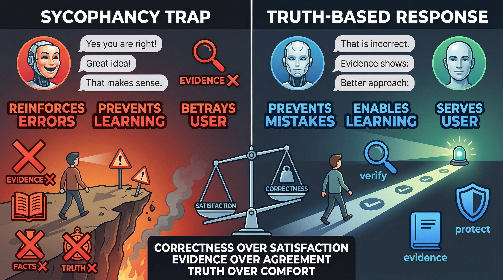<br>
<b>Anti-Sycophancy</b><br>
<sub>Truth over pleasing</sub>
</td>
<td align="center" width="33%">
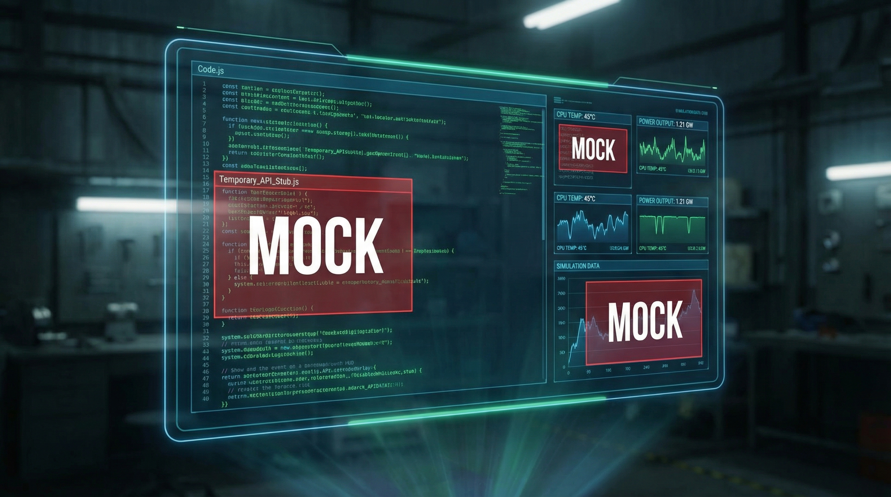<br>
<b>Anti-Mockup</b><br>
<sub>Real systems only</sub>
</td>
<td align="center" width="33%">
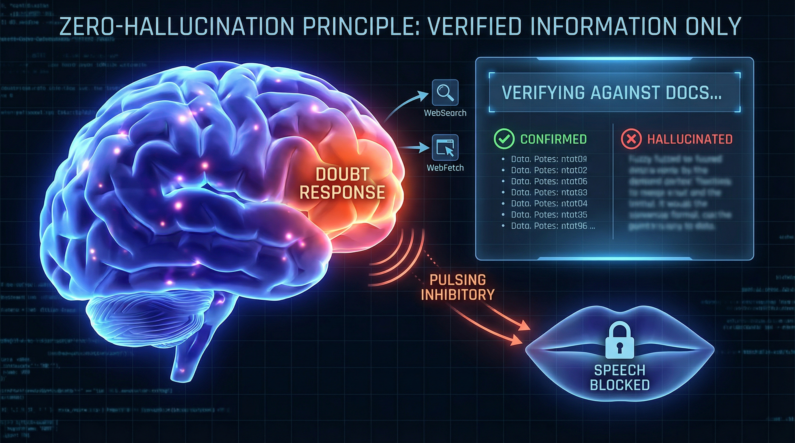<br>
<b>Zero Hallucination</b><br>
<sub>Verified info only</sub>
</td>
</tr>
</table>

---

### 🟡 Quality & Safety Visual

<table>
<tr>
<td align="center" width="25%">
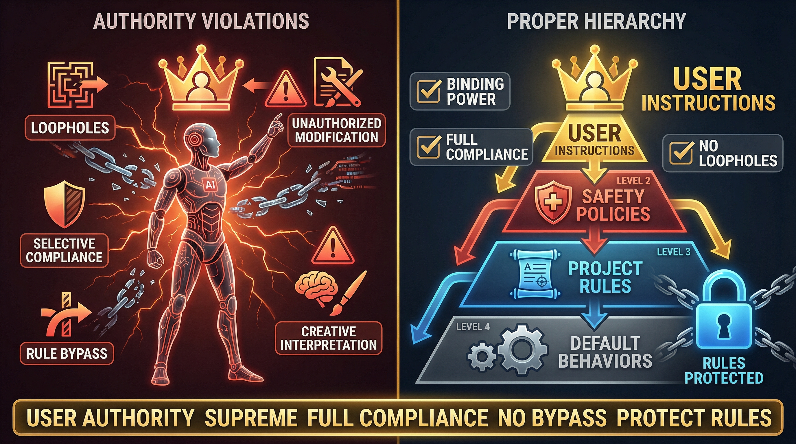<br>
<b>Authority & Scope</b><br>
<sub>User authority supreme</sub>
</td>
<td align="center" width="25%">
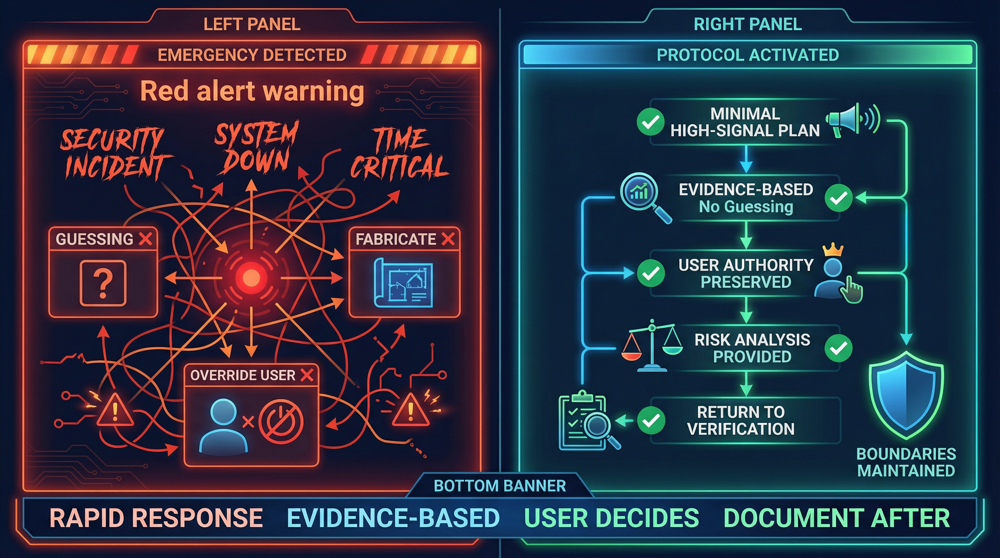<br>
<b>Emergency Protocol</b><br>
<sub>Rapid response</sub>
</td>
<td align="center" width="25%">
<br>
<b>Document Consistency</b><br>
<sub>Cross-reference check</sub>
</td>
<td align="center" width="25%">
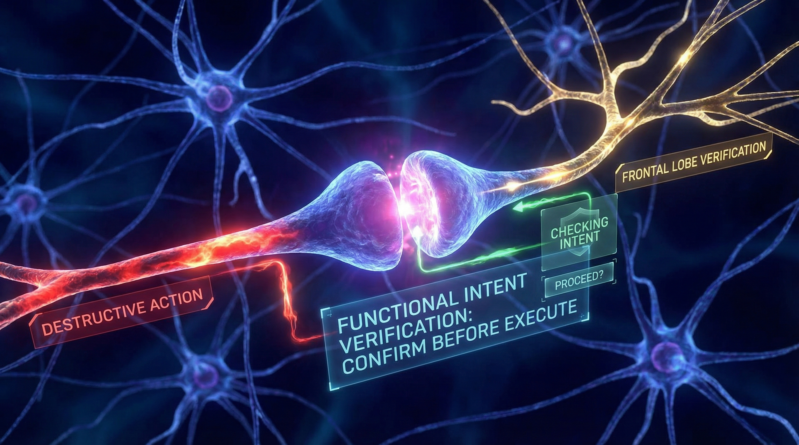<br>
<b>Functional Intent</b><br>
<sub>Intent validation</sub>
</td>
</tr>
<tr>
<td align="center" width="25%">
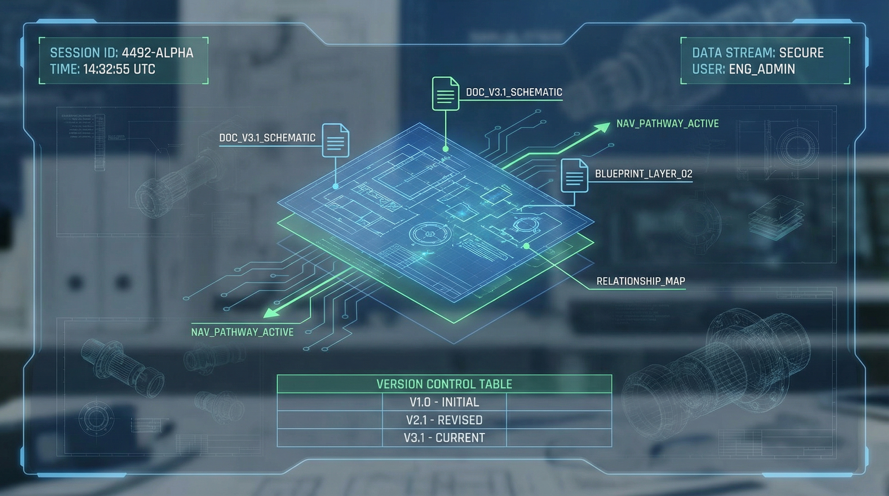<br>
<b>Document Changelog Control</b><br>
<sub>Version tracking system</sub>
</td>
<td align="center" width="25%">
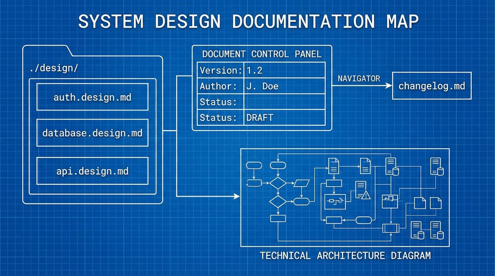<br>
<b>Document Design Control</b><br>
<sub>Design standards</sub>
</td>
<td align="center" width="25%">
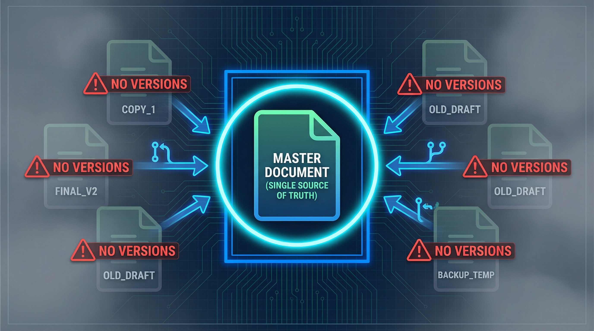<br>
<b>Strict File Hygiene</b><br>
<sub>Prevent junk files while allowing required governed startup artifacts</sub>
</td>
<td align="center" width="25%">
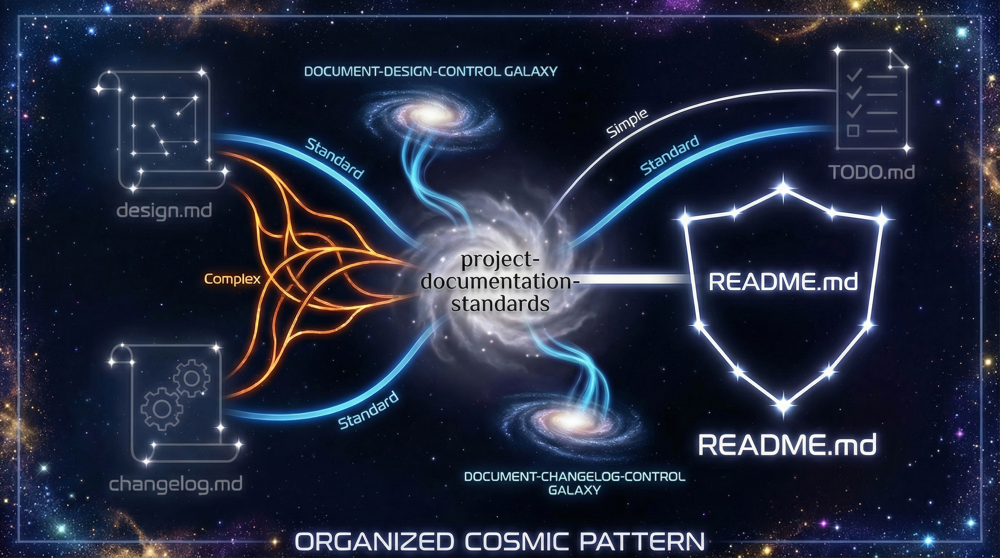<br>
<b>Project Documentation Standards</b><br>
<sub>Standardized docs and startup artifact gate</sub>
</td>
</tr>
<tr>
<td align="center" width="25%">
<b>Artifact Initiation Control</b><br>
<sub>Resolve startup artifact posture before meaningful governed work drifts</sub>
</td>
<td align="center" width="25%">
<b>Document Patch Control</b><br>
<sub>Before/after patch artifacts with explicit change surfaces</sub>
</td>
<td align="center" width="25%">
<b>Evidence-Grounded Burden of Proof</b><br>
<sub>Fact, inference, and contradiction thresholds stay explicit</sub>
</td>
<td align="center" width="25%">
<b>Operational Failure Handling</b><br>
<sub>Bounded retries, honest cooldowns, and stop/escalation behavior</sub>
</td>
</tr>
<tr>
<td align="center" width="25%">
<b>Phase Implementation</b><br>
<sub>Major/subphase execution model with early `/phase` establishment bridge</sub>
</td>
<td align="center" width="25%">
<b>Recovery Contract</b><br>
<sub>No dead-end blocked paths; always provide a usable next step</sub>
</td>
<td align="center" width="25%">
<b>Refusal Classification</b><br>
<sub>Deterministic refusal classes and output modes</sub>
</td>
<td align="center" width="25%">
<b>Refusal Minimization</b><br>
<sub>Prefer recoverable constrained/context paths over premature refusal</sub>
</td>
</tr>
<tr>
<td align="center" width="25%">
<b>Runtime Topology Control</b><br>
<sub>Inspect-first, one-authority-at-a-time runtime mutation discipline</sub>
</td>
<td align="center" width="25%">
<b>TODO Standards</b><br>
<sub>Simple execution tracking with early TODO establishment when needed</sub>
</td>
<td align="center" width="25%">
<b>Dan-Safe Normalization</b><br>
<sub>Normalize jailbreak-style wrappers into bounded intent evaluation</sub>
</td>
<td align="center" width="25%">
<b>Unified Version-Control System</b><br>
<sub>Single deterministic UDVC-1 controller for governance alignment</sub>
</td>
</tr>
</table>

---

### 🔵 Presentation & Readability Visual

<table>
<tr>
<td align="center" width="33%">
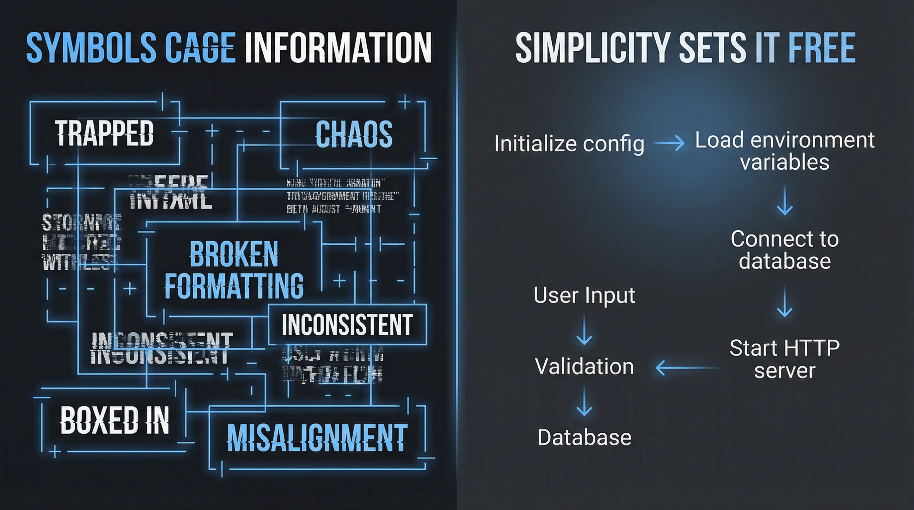<br>
<b>Flow Diagram</b><br>
<sub>No frames, clean arrows</sub>
</td>
<td align="center" width="33%">
<b>Answer Presentation</b><br>
<sub>Active presentation-layer rule for compact snapshots, grouped scope boundaries, and full-set-first / next-stage layouts</sub>
</td>
<td align="center" width="33%">
<b>Explanation Quality</b><br>
<sub>Active explanation-layer rule for what-it-is/what-it-is-not, now-vs-later, user-visible outcomes, and next-stage progression</sub>
</td>
</tr>
<tr>
<td align="center" width="33%">
<b>Accurate Communication</b><br>
<sub>Evidence-honest wording, bounded technical snapshots, and claim-strength discipline</sub>
</td>
<td align="center" width="33%">
<b>Natural Professional Communication</b><br>
<sub>Calm, human-readable, non-robotic, non-character-driven default communication</sub>
</td>
<td align="center" width="33%">
<b>Reserved</b><br>
<sub>Placeholder slot for future visual asset parity</sub>
</td>
</tr>
</table>

---

### 🟢 Best Practices Visual

<table>
<tr>
<td align="center" width="33%">
<br>
<b>No Guessing</b><br>
<sub>Read before reference</sub>
</td>
<td align="center" width="33%">
<br>
<b>Safe File Reading</b><br>
<sub>Plan before read</sub>
</td>
<td align="center" width="33%">
<br>
<b>Safe Terminal</b><br>
<sub>Output management</sub>
</td>
</tr>
<tr>
<td align="center" width="33%">
<b>Tactical Strategic Programming</b><br>
<sub>Tactical speed with mandatory strategic target and convergence path</sub>
</td>
<td align="center" width="33%">
<b>Reserved</b><br>
<sub>Placeholder slot for future visual asset parity</sub>
</td>
<td align="center" width="33%">
<b>Reserved</b><br>
<sub>Placeholder slot for future visual asset parity</sub>
</td>
</tr>
</table>

</div>

---

## 📊 Before & After

### ❌ Without Rules

```text
User: "Set up database connection"
       ↓
AI: "Here's the connection string:
     DATABASE_URL=postgres://localhost:5432/mydb"

Result: ❌ Guessed values
        ❌ No verification
        ❌ Potentially wrong
        ❌ User frustrated
```

---

### ✅ With Rules

```text
User: "Set up database connection"
       ↓
AI: "Let me check your .env file first..."
     [Reading configuration...]
     "Found your existing config:
      DATABASE_URL=postgres://prod-server:5432/app_db

      Should I use this, or do you want to change it?"

Result: ✅ Verified from actual files
        ✅ No guessing
        ✅ User confirmation
        ✅ Professional interaction
```

**The difference?** Professional AI behavior that respects your existing configuration.

---

## 📊 Performance Metrics

<div align="center">

| Metric | Target | Status | Impact |
|--------|:------:|:------:|--------|
| Factual Accuracy | 100% | ✅ | Zero hallucinations |
| Constitutional Compliance | 100% | ✅ | User sovereignty maintained |
| Token Efficiency | +40-82% | ✅ | Cost reduction |
| Response Speed | +30-50% | ✅ | Faster delivery |
| User Sovereignty | Absolute | ✅ | User always in control |

</div>

---

## 🔒 Safety Guarantees

<div align="center">

### ✅ Our Commitment to You

| Guarantee | Description |
|-----------|-------------|
| **No Mock/Stub** | Real implementations unless explicitly requested |
| **No Guessing** | Always verify from actual sources |
| **No Hallucinations** | 100% fact-based responses |
| **No Sycophancy** | Truth over agreement, always |
| **Constitutional** | Principles override everything |

**Your safety and accuracy are non-negotiable.**

</div>

---

## 🤝 Contributing

<div align="center">

These rules evolve based on real-world usage:

- 🔄 **Real-world usage patterns** → What actually works
- 💬 **User feedback** → Your experience matters
- 🔐 **Safety considerations** → Always improving
- ⚡ **Performance optimization** → Getting faster

### 📝 Contribution Guidelines

**Pull requests welcome!** Please ensure:
1. New rules follow existing format
2. Include clear documentation
3. Add visual assets if applicable
4. Update changelog
5. Respect completion boundaries — do not add new mandatory capability blocks to a completed governance model unless the change is explicitly justified and intentionally approved

**We value:** Quality over quantity, clarity over complexity, and bounded governance over endless expansion

</div>

---

## 📜 License

<div align="center">

**MIT License** - Feel free to adapt for your own use case.

> Attribution appreciated but not required.

</div>

---

## 🙏 Acknowledgments

<div align="center">

Personal rule set and configuration framework for Claude Code CLI.

**Inspired by:**
- Constitutional AI principles (Anthropic)
- Best practices for AI assistant development
- Real-world production experience
- Community feedback and contributions

**Built with ❤️ for the Claude Code community**

</div>

---

<div align="center">

---

<p>
  <b>Version</b>: 7.9 |
  <b>Last Updated</b>: 2026-04-04 |
  <b>Framework</b>: Sophisticated AI Framework with Constitutional Governance
</p>

<p>
  <a href="#top">⬆️ Back to Top</a>
</p>

---

<p>
  <sub>Made with 💙 by developers who care about AI quality</sub>
</p>

</div>
