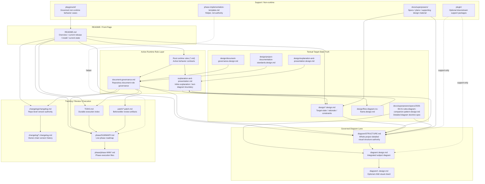

# RULES Diagram Structure

> **Status:** Active whole-project visual structure surface / Released
> **Current Doctrine Basis:** [../docs/superpowers/specs/2026-06-01-rules-diagram-companion-pattern-design.md](../docs/superpowers/specs/2026-06-01-rules-diagram-companion-pattern-design.md)
> **Design Alignment:** [../design/document-governance.design.md](../design/document-governance.design.md)
> **Current Release:** v10.37 / P129
> **Session:** 1f1873d2-0feb-485f-a5ff-d383254590dd

---

## Purpose

This file is the top-level whole-project visual structure authority for RULES.

พูดง่าย ๆ: ถ้าผู้อ่านต้องการเข้าใจ project ผ่าน diagram ให้มากที่สุด ให้เริ่มที่ไฟล์นี้ก่อน ไม่ใช่ใช้มันเป็นแค่ index/router แล้วค่อยเดาโครงสร้างเอาเอง.

This surface should let a reader understand:
- the repo's major document families
- which surfaces are active authority versus support-only
- how runtime rules, design, diagram, changelog, TODO, phase, patch, docs, playground, and plugin areas relate
- which later subject diagrams are zoom-in / decomposition views of the global structure instead of disconnected one-off pictures

---

## Diagram source contract

Governed `diagram/` source in RULES must be Kroki-compatible always.

Current contract for this lane:
- diagram source is mandatory Kroki-compatible, not optional
- supported breadth is all formats that are both Kroki-compatible and governance-suitable
- governance-suitable means text-source-governable, diff/review-friendly, semantically stable enough for source truth, and portable enough for repo-governed workflow
- inline answer/status/phase-local text diagrams are not governed `diagram/` source truth automatically and do not enter this contract unless explicitly promoted into `diagram/`

This file currently uses a Kroki-compatible Mermaid source block as the canonical whole-project structure rendering surface.

---

## Whole-project structure diagram

---

## How to read this structure

1. Start with `README.md` for the current front-page reading of the repo.
2. Use the runtime rule layer to understand active behavior contracts.
3. Use `design/` for semantic truth and detailed target-state meaning.
4. Use `diagram/STRUCTURE.md` for the whole-project structural view.
5. Move into `diagram/<subject>.design.md` only when a subject needs deeper visual treatment.
6. Use changelog / TODO / phase / patch as tracking, review, and execution surfaces rather than as semantic owners.

---

## Authority boundaries

- `design/` owns semantic truth and target-state meaning.
- `diagram/` owns Kroki-compatible visual synthesis and relationship explanation.
- If text and diagram differ, `design/` wins semantically.
- `diagram/STRUCTURE.md` is the global structural view, not a substitute for design semantics.
- `diagram/<subject>.design.md` should zoom into or decompose the global structure rather than restart as an unrelated fragment.
- `changelog/`, `TODO.md`, `phase/`, and `patch/` may track diagram work, but they do not own diagram meaning.
- plugin/preview/manifest/report output stays support-only and must not become source truth.

---

## Subject-diagram rule

When a RULES subject needs governed visual explanation:
- start with `diagram/<subject>.design.md`
- keep it bodyful and integrated by default
- make it a zoom-in / decomposition view of the relevant portion of `diagram/STRUCTURE.md`
- split into `diagram/<subject>/<NN>-<slice>.design.md` only when the diagram itself becomes too broad or separates into genuinely different visual questions

What is **not** enough reason to split:
- matching design shards for symmetry alone
- making plugin implementation easier
- forcing one diagram file per text heading
- avoiding the work of keeping the whole-project structure surface detailed and current

---

## Current released posture

Current released posture in v10.37 / P129:
- governed `diagram/` source is mandatory Kroki-compatible
- all allowed breadth is defined as Kroki-compatible + governance-suitable
- `diagram/STRUCTURE.md` is the bodyful top-level whole-project detailed visual structure authority
- subject diagrams are governed zoom-in / decomposition views under the global structure
- inline answer/status/phase-local text diagrams remain outside governed source truth unless explicitly promoted into `diagram/`
